# Recon 

## Ping
First of all what I'm going to do is use **ping** to know if the machine is up. 
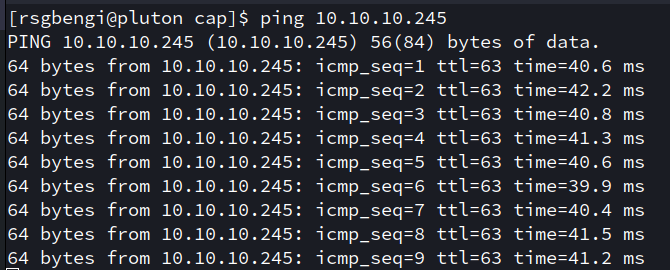


In this case, I don't need to know the operating system of the machine because HTB already gives us that information.
Nevertheless, A cool tip about ping is that it allows you to know more or less the **operating system** used by the 
machine base on the **ttl** (I will leave a link to a page to know more about this in the reference). So like the 
ttl is 64 I asume that the machine uses **linux**.

## Nmap
### PortScan
After use ping, I usually use **nmap** to search for open ports using the following options:
- **-p-** With this flag I'm specifying that the scan will be performed on all ports
- **--open** Using this flag I'm specifying that I only want to show open ports
- **-T5** With this flag I'm specifying that the scan be as fast as possible( The faster the louder the scan)
- **-v** With this flag I'm indicating that the results are shown on the screen as the are found
- **-n** With this flat I'm indicating that I dont't want DNS resolution
- **-oN portscan** To export the result to the portscan file in the nmap format
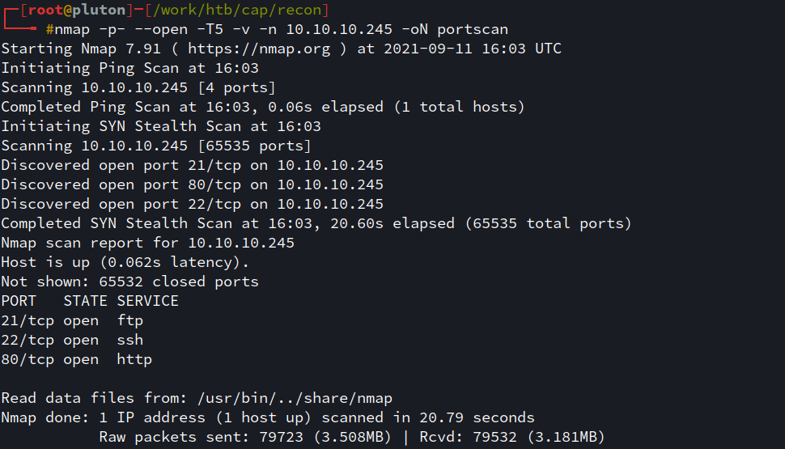

### Port services found
After knowing which ports are open, I will find out what services they are using.

- **-sC** To use basic enumeration scripts
- **-sV** To display the services found on the specified ports 
- **-p21,22,80** To specifying ports
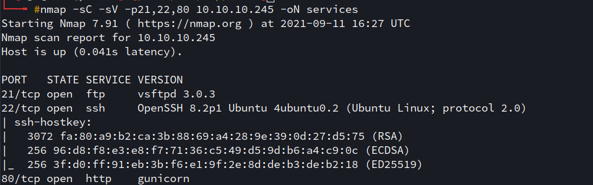

As a result of the picture above, I can know that:
- **-ftp** service is on port 21 
- **-ssh** service is on port 22 
- **-http** is on port 80.
The first two are typically used to access the machine when you have a user. For this reason, 
I will start analyzing the website.
## Analyzing the website
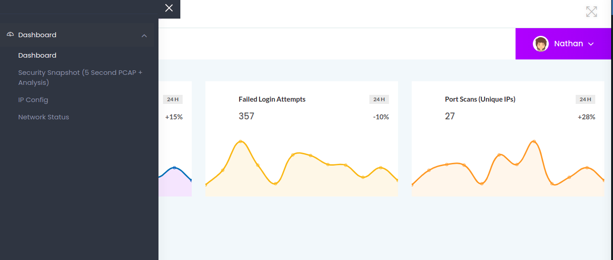
As a result of the analysis, i found within **Security Snapshot** the possibility of downloading a 
**pcap** file. So that's what i did. Nevertheless as you can see in the image below, there was no
information:
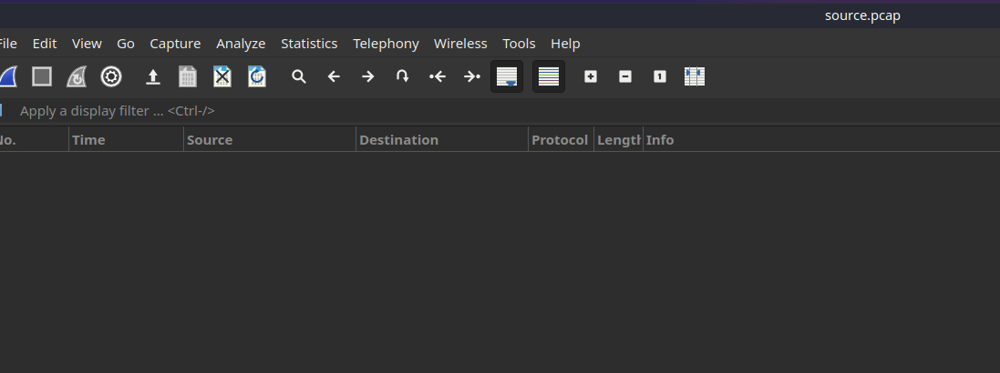

So what i did next was inspect the button that you click to download the pcap and 
what i saw was the following : **location.href='/download/8'**. Which made me imagine that there could be a possibility
that there would be another **pcap file** if instead of using an 8 it would use any other number. 
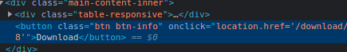

## WFUZZ

To fuzz I usually use **wfuzz**. You can do the following to install the tool:
```python
pip install wfuzz
```
The configuration for run the program was: 
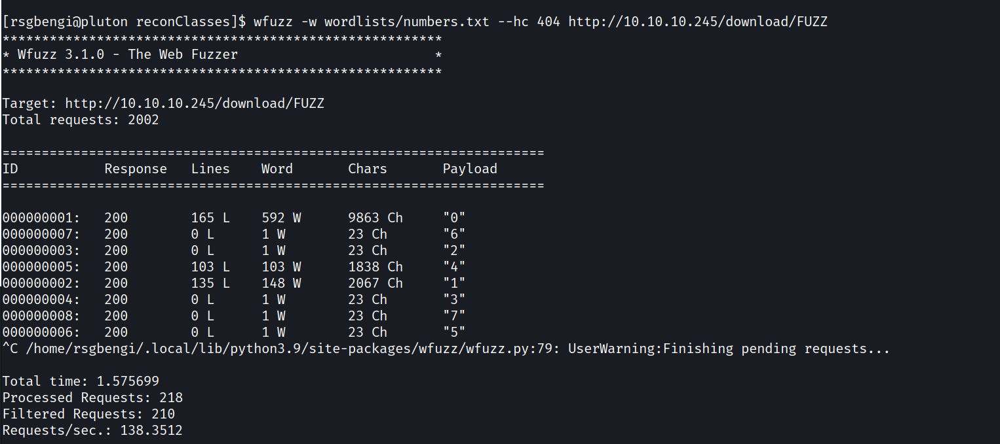

- **-w** To select the wordlist. In this case, I used a a list with numbers from 0 to 10000.
- **--hc** To not show requests that result in 404.

What we can see in the image above is that there are more **pcaps**. For example, I can download the file  
at: **http://ip/download/0**. 
If I open this new file with **wireshark** we could see that this time the file does have data:
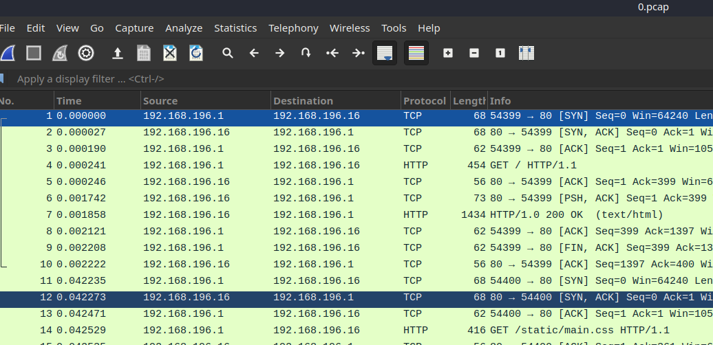

## Searching for user and password 

After finding the file, the fist thing i did was use the wireshark filters to search for valid credentials
to access the machine. Hitting **ctrl+f** and searching for **user**, I found the a possible user and password!!: 
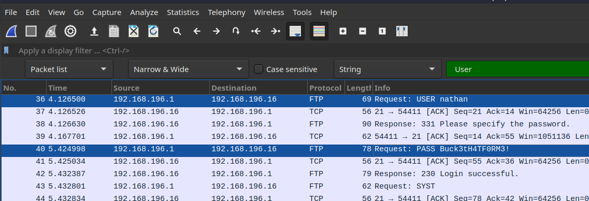

Then I tried to connect to the machine using **ssh** checking that, indeed, I could access.
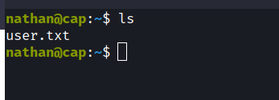

# Privilege escalation

Normally after logging in, the first thing I do is download **Linpeas** into the remote machine using **wget** and 
**python http server**. (If you didn't know, Linpeas is a tool for privilege escalation I will leave a link in the reference). 

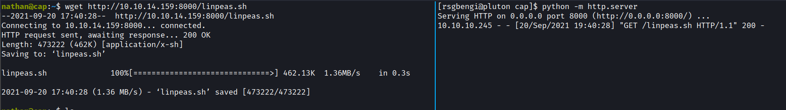

The privilege escalation took me some time so I'll get straight to the point. After running **linpeas** in the capabilities section you will be shown the following:
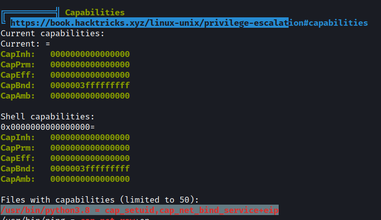
Another way to get the capabilities will be:
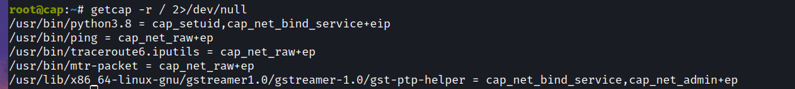
**Linux capabilities** are linux features that allow better security management.I will leave a link to a very good article  explaining this topic. As we can see in the image above, python has **cap_setuid** which allows the user to change the **UID**(user identifier).
So I can do something like this to become root:
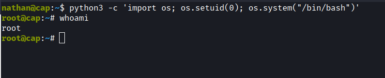

# Thanks for reading
Thanks for reading the post and don't forget to share it :smile:.

# References
## TTL
[https://subinsb.com/default-device-ttl-values/](https://subinsb.com/default-device-ttl-values/)
## Linpeas
[https://github.com/carlospolop/PEASS-ng/tree/master/linPEAS](https://github.com/carlospolop/PEASS-ng/tree/master/linPEAS)
## Capabilities
[https://www.hackingarticles.in/linux-privilege-escalation-using-capabilities/](https://www.hackingarticles.in/linux-privilege-escalation-using-capabilities/)