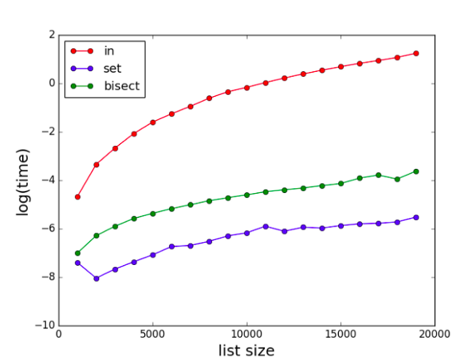

---
# Getting started
This post will contain many interesting tips and tricks that I have learned these last months and I use constantly. 
So let's get started :smile:.
# One-Liners
If you are familiar with python, you will know that the 
language has many powerful **One-Liners expressions**. For that reason, I will show you some of them. 
## List Comprehensions
The first one is probably my favorite, because it allows you to  manipulate lists in a really cool way.  
For example, instead of doing it that way, which is how almost everyone does it:
```python
lis = []
for i in range(10):
    list.append(i)
```
You can do something more elegant like this one:
```python
lis = [i for i in range(10)]
```
Moreover, you can use the **if/else statement** to, for example, create a list with only even numbers:
```python
lis = [i for i in range(10) if i % 2 == 0]
```
## Use of join with list comprehension
Related to **list comprehensions**, you can use the function **join** to join all elements on a list into a **string**. 
Continuing the previous example: 
```python
numbers_to_str = ",".join([str(i) for i in list if i % 2 == 0])
#Result: 0,2,4,6,8
``` 
## Swapping of two numbers
If, for example, we are implementing the bubble sorting algorithm we usually do this:
```python
 
def bubbleSort(lis):
    n = len(lis)
    aux = 0
    for i in range(n-1):
        for j in range(0, n-i-1):
            if lis[j] > lis[j + 1] :
                aux = lis[j]
                lis[j] = lis[j+1]
                lis[j+1] = aux
```
Nevertheless, with python, we can use the next one liner to swap the elements without the need to use the variable **aux**. 
```python
def bubbleSort(lis):
    n = len(lis)
    for i in range(n-1):
        for j in range(0, n-i-1):
            if lis[j] > lis[j + 1] :
                lis[j], lis[j + 1] = lis[j + 1], lis[j]
```
## Reversing a list 
With this technique you can create a reverse list in an exquisite way:

```python
lis = [1, 2, 3]
reversed_list = lis[::-1]
  
print(reversed_list)
# Result: 3 2 1 

```
## Assign multiple variables in One Line 
You can assign multiple values to multiple variables by separating variables and values with commas:
```python
x, y, z = 3, 4, 5
print(x, y , z) 
#Result 3 4 5 
```
## If conditions 
The final One-Liner that I want to share is a way to make conditions more readable.
Normally programmers tend to do this:
```python
if x == 2 and x == 3 and x == 5:
    print("Hello world!")
```
But if we use the operator **in** we can code it as: 
```python
if x in [2,3,5]:
    print("Hello world!")
```
# Enumerate 
When you want to go through a list and use both the index and the value contained in said memory position, this tip comes in handy.
> Enumerate is a built-in function of Python and allows us to loop over an iterable and have an automatic counter. It essentially pairs every element in our list with the corresponding index. Most of the newcomers and even some advanced programmers are unaware of it.
```python
lis = [2,4,1,5]
for i,value in enumerate(lis):
    print(i,value)
"""
Result
0 2
1 4
2 1 
3 5 
"""
```
# Anti-Patterns
>Anti-patterns are certain patterns in software development that are considered bad programming practices.
Hopefully, with these examples, you will write better code for your development career.
## Check if an element is inside a list 
Consider using set or bisect for check if an element is in a large list:
```python
# bad practice
list_of_letters = ["A", "B", "C", "A", "D", "B"]
check = "A" in list_of_letters

# good practice
set_of_letters = {"A", "B", "C", "D"}
check = "A" in set_of_letters
```


## Not using get to return default values from a dictionary 
When you use **get**, python checks if the key exists. The second argument would be returned if this key doesn't exist.
```python
# bad practice
fruit_price = {
    "Apple" : 1
    "Orange": 2
    "Pear" : 3
}
get_price_of = "Apple"
if get_price_of in fruit_price:
    price =  fruit_price[get_price_of]
else:
    price = None 
# good practice
price = fruit_price.get(get_price_of,None)
```
## Try/except blocks that don't handle exceptions meaningfully 
Ignoring the exception should never be done.
```python
numbers = [0,1,2,3]

result = 0
for number in numbers:
    try:
        result += 1/num
    except:
        pass


#good practice
result = 0
for number in numbers:
    try:
        result += 1/num
    except ZeroDivisionError:
        print("Don't divide by zero!" )

# alternative you can use suppress 
from contextlib import suppress 
with suppress(Exception):
    for number in numbers:
        result += 1/num
```
# Thanks for reading 

If you think that the article has been useful to you, please share it and see you soon :smile: :boom:.


# References
[https://www.geeksforgeeks.org/powerful-one-liner-python-codes/](https://www.geeksforgeeks.org/powerful-one-liner-python-codes/)
[https://towardsdatascience.com/12-python-tips-and-tricks-for-writing-better-code-b57e7eea580b](https://towardsdatascience.com/12-python-tips-and-tricks-for-writing-better-code-b57e7eea580b)
[https://towardsdatascience.com/quick-python-tip-suppress-known-exception-without-try-except-a93ec34d3704](https://towardsdatascience.com/quick-python-tip-suppress-known-exception-without-try-except-a93ec34d3704)


---
